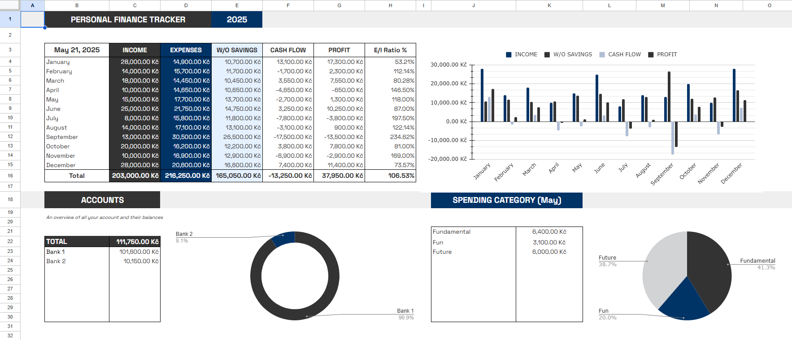
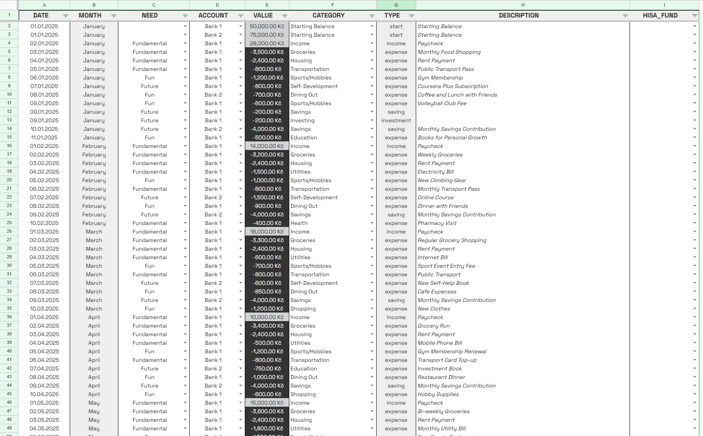
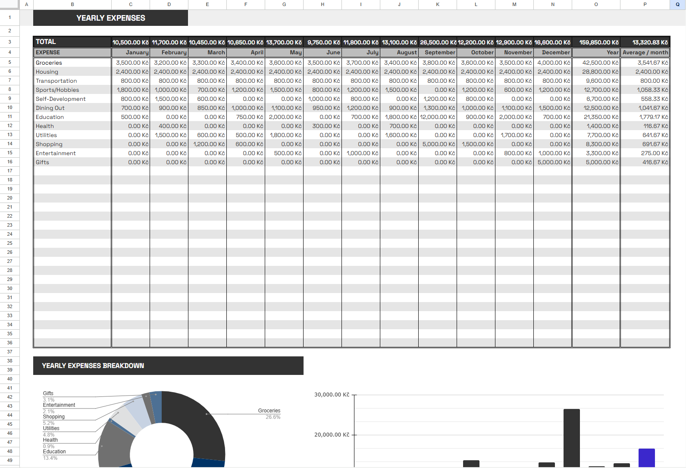
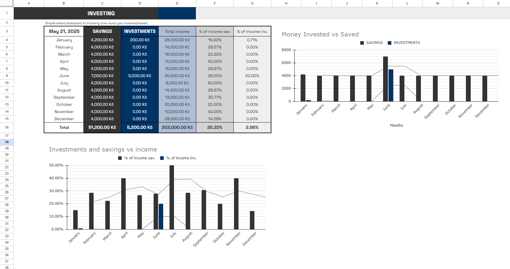

# 📊 Google Sheets Budgeting Tool with Analysis

A comprehensive personal finance management system that combines a powerful Google Sheets dashboard with Python-based data analysis capabilities. This project showcases my expertise in financial data processing, API integration, and modern data analysis techniques.

## 🧾 Overview

- 📈 **Interactive Budgeting Dashboard:** A feature-rich Google Sheets template for tracking, categorizing, and visualizing personal finances  
- 🔄 **Automated Data Pipeline:** Python-based ETL (Extract, Transform, Load) system that integrates with Google Sheets API  
- 📊 **Advanced Financial Analysis:** Custom analytics module for deriving actionable insights from financial data  

## ⚙️ Technical Features

- 🔐 **Automated Data Import:** Secure OAuth2 authentication with the Google Sheets API to fetch and update financial data  
- 🧹 **Robust Data Processing:** Comprehensive data cleaning and transformation pipeline using pandas  
- 📉 **Financial Analysis Tools:** Custom functions for expense categorization, trend analysis, and financial ratio calculations  
- 🛠️ **Error Handling & Logging:** Production-grade error handling with detailed logging for troubleshooting  
- ✅ **Type Safety:** Static type checking with Python type hints for increased code reliability  

## 💡 Skills Demonstrated

- 🧮 **Google Sheets Mastery:** Advanced formulas, conditional formatting, and custom dashboard design  
- 🌐 **API Integration:** Authentication, data fetching, and error handling with external APIs  
- 🏗️ **Data Engineering:** ETL pipeline design and implementation  
- 🐍 **Python Development:** Modular, maintainable code with proper documentation  
- 📚 **Data Analysis:** Financial metrics calculation and statistical analysis using pandas  
- 🧰 **Production-Ready Code:** Error handling, logging, and performance optimization  

## 💼 Professional Applications

The skills demonstrated in this project directly translate to professional contexts:

- 📊 **Business Intelligence:** Ability to create custom BI solutions that integrate with various data sources  
- 💸 **Financial Analysis:** Experience with financial data modeling and visualization techniques  
- 🤖 **Process Automation:** Capability to build automated workflows that save time and reduce manual errors  
- 🔌 **Data Integration:** Expertise in connecting disparate systems through APIs and data pipelines  

## 🧠 Key Learnings

- 🔒 **API Security Best Practices:** Implementation of secure authentication flows and credential management  
- 🧱 **ETL Design Patterns:** Architectural approaches for reliable data extraction and transformation  
- 📈 **Financial Data Modeling:** Techniques for accurately representing and analyzing complex financial information  
- 🚀 **Performance Optimization:** Methods for handling large datasets efficiently while maintaining system responsiveness  
- 📝 **Documentation Excellence:** Creating clear, comprehensive documentation that enhances code maintainability  

## 📸 The Dashboard in Action

### 🧩 Main Dashboard Overview

  
*The main dashboard provides a comprehensive view of financial health with key metrics and visualizations*

### 🧾 Transaction Tracking

  
*Detailed transaction tracking with automatic categorization and filtering capabilities*

### 📆 Yearly Financial Overview

  
*Annual financial summary with trend analysis and year-over-year comparisons*

### 💰 Savings Tracker

  
*Dedicated savings tracker with goal-setting functionality and progress visualization*

---

📌 *This project demonstrates my ability to bridge financial analysis with modern data engineering practices — skills that I can apply to solve real business problems involving data integration, analysis, and reporting.*
